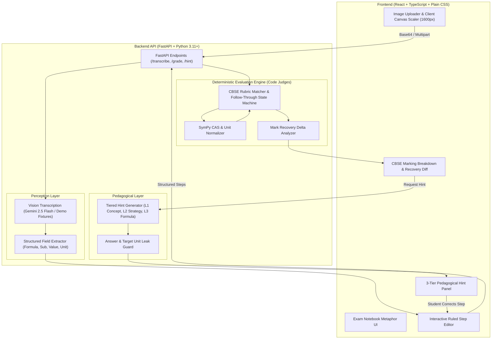

# MarkLoss 📝

> **A step-level AI examiner for handwritten exam answers.**  
> *Tells students exactly where they lost marks and guides them to recover them with hints, not answers.*

Built for **Horizon 2026** *(AI in Education — Personalized, Accessible, High Impact)*.

[](https://python.org)
[](https://fastapi.tiangolo.com)
[](https://react.dev)
[](https://www.typescriptlang.org)
[](https://www.sympy.org)
[](LICENSE)

---

## 🎯 The Problem & Our Core Philosophy

In board exams (such as CBSE Class 10 & 12 Physics and Mathematics), students don't just receive a single pass/fail grade—answers are evaluated using **step-by-step marking schemes**:
1. **Formula selection** ($1\text{ mark}$)
2. **Value substitution** ($0.5\text{ marks}$)
3. **Calculation execution** ($1\text{ mark}$)
4. **Unit specification & final statement** ($0.5\text{ marks}$)

When practicing with conventional AI chatbots, students face two fatal flaws:
1. **Hallucinated grading:** Generative models are notoriously unreliable at arithmetic, unit conversions, and algebraic equivalence.
2. **Premature spoiler hints:** Chatbots immediately blurt out the final numerical solution, depriving the student of the productive struggle needed to actually master the concept.

### Our Core Principle: *"The LLM reads and explains. Code judges."*

- **The LLM (Gemini 2.5 Flash)** performs perception (transcribing handwritten steps from photos) and pedagogical phrasing (generating graduated hints guarded against answer leaks).
- **Deterministic Python & SymPy code** executes all scoring:
  - Symbolic algebraic equivalence check using Computer Algebra System (`sympy`).
  - Unit normalization into canonical SI dimensions ($1\,\text{k}\Omega \to 1000\,\Omega$, $500\,\text{mA} \to 0.5\,\text{A}$).
  - Robust numerical tolerance ($\pm 2\%$ relative tolerance or calibrated absolute bounds).
  - Board-grade **follow-through marks**: If a student makes an arithmetic slip in Step 2 but correctly applies their erroneous intermediate value in Step 3, they are awarded method marks for Step 3.

---

## 🏛️ Architecture & Data Flow



---

## 🎨 Visual Identity: The Exam Paper Metaphor

MarkLoss rejects generic, dark-themed AI chat interfaces in favor of a tactile, board exam answer sheet aesthetic:
- **Notebook Paper Surface:** Warm off-white background (`#FAF7F0`), horizontal ruled feint lines (`#DCE6EE`), and vertical red margin rule (`#E8A9A2`).
- **Typography:** *Newsreader* for question statements, *IBM Plex Sans* for clean interface controls, *IBM Plex Mono* for mathematical steps, and *Caveat* for handwriting accents.
- **Examiner's Ink:** Authentic crimson red (`#C23B2E`) for marks deductions, strikethroughs, and margin callouts.
- **Ochre Highlighter:** Warm gold (`#E9C46A`) sweeps across steps with pedagogical feedback.
- **Accessible & Responsive:** Fully responsive down to mobile viewports, high-contrast text ratios ($>7:1$), full ARIA live regions, and `@media (prefers-reduced-motion: reduce)` support.

---

## 📚 Problem Bank

MarkLoss includes **15 curated problems** from CBSE Class 10 & 12 Physics and Mathematics, each encoded with multi-step marking schemes, variable bindings, dependencies, and follow-through rules:

| ID | Subject | Class | Chapter / Topic | Marks |
| :--- | :--- | :--- | :--- | :--- |
| `phy-ohm-01` | Physics | 10 | Electricity (Ohm's Law: $V = I \cdot R$) | 3 |
| `phy-res-02` | Physics | 10 | Electricity (Resistors in Parallel: $1/R_p = 1/R_1 + 1/R_2$) | 3 |
| `phy-heat-03` | Physics | 10 | Joule's Law of Heating ($H = I^2 \cdot R \cdot t$) | 3 |
| `phy-lens-04` | Physics | 10 | Light (Lens Formula: $1/f = 1/v - 1/u$) | 3 |
| `phy-mirror-05` | Physics | 10 | Light (Mirror Formula & Magnification) | 3 |
| `phy-coulomb-06` | Physics | 12 | Electrostatics (Coulomb's Law: $F = k \cdot q_1 \cdot q_2 / r^2$) | 3 |
| `phy-cap-07` | Physics | 12 | Capacitors in Series & Parallel | 3 |
| `phy-em-08` | Physics | 12 | Electromagnetic Induction ($\mathcal{E} = -L \cdot \Delta I / \Delta t$) | 3 |
| `math-quad-01` | Math | 10 | Quadratic Formula ($x = \frac{-b \pm \sqrt{b^2 - 4ac}}{2a}$) | 3 |
| `math-ap-02` | Math | 10 | Arithmetic Progressions ($a_n = a + (n-1)d$) | 3 |
| `math-trig-03` | Math | 10 | Trigonometric Identities ($\sin^2\theta + \cos^2\theta = 1$) | 2 |
| `math-circle-04`| Math | 10 | Areas Related to Circles (Sector Area: $\frac{\theta}{360} \pi r^2$) | 3 |
| `math-diff-05` | Math | 12 | Derivatives (Product & Chain Rule) | 3 |
| `math-int-06` | Math | 12 | Definite Integration ($\int_a^b x^2 dx$) | 3 |
| `math-matrix-07`| Math | 12 | Matrices (Determinants & $2 \times 2$ Inverse) | 3 |

---

## ⚡ Quickstart & Local Setup

### Prerequisites
- Python 3.11+
- Node.js 18+ and npm 9+

### 1. Clone & Set Up Backend

```bash
# Clone the repository
git clone https://github.com/your-org/markloss.git
cd markloss

# Create virtual environment and install dependencies
cd backend
python3 -m venv .venv
source .venv/bin/activate
pip install -r requirements.txt

# (Optional) Copy .env.example if you wish to supply a Gemini API key
cp .env.example .env

# Start FastAPI server on port 8000
uvicorn app.main:app --reload --port 8000
```

> **Note:** By default, if `LLM_API_KEY` is not provided in `.env`, the server boots in **`DEMO_MODE=true`** out of the box. All 15 problems work with bundled handwriting samples and deterministic mock responses without requiring an API key.

### 2. Set Up Frontend

In a separate terminal window:

```bash
cd frontend
npm install

# Start Vite dev server on port 5173
npm run dev
```

Visit **`http://localhost:5173`** in your browser.

---

## 🧪 Automated Testing

MarkLoss includes 54 comprehensive unit and integration tests covering the deterministic CAS, follow-through rules, unit conversions, hint leak guards, and HTTP error boundaries.

```bash
# Run all backend tests
cd backend
source .venv/bin/activate
pytest tests/ -v
```

```
backend/tests/test_api.py .........                                      [ 16%]
backend/tests/test_hardening.py .........                                [ 33%]
backend/tests/test_hints.py ....                                         [ 40%]
backend/tests/test_rubric_solutions.py ................                  [ 70%]
backend/tests/test_scorer.py .........                                   [ 87%]
backend/tests/test_verify.py .......                                     [100%]
============================== 54 passed in 0.43s ==============================
```

```bash
# Test frontend production build
cd frontend
npm run build
```

---

## 🔌 API Reference

All requests and responses use standard JSON contracts with explicit error models:

| Method | Endpoint | Description | Sample Payload / Params |
| :--- | :--- | :--- | :--- |
| `GET` | `/api/health` | Service health, version, and `demo_mode` state | — |
| `GET` | `/api/problems` | List all available curriculum problems and metadata | `?subject=physics&class_num=10` |
| `GET` | `/api/problems/{id}`| Detailed problem schema, marking scheme, and rules | Path: `id` (e.g. `phy-ohm-01`) |
| `POST` | `/api/transcribe` | Transcribe handwritten image into numbered steps | Multipart `file`, form-data `problem_id` |
| `POST` | `/api/grade` | Deterministically score student steps against rubric | `{ problem_id: "...", steps: [...] }` |
| `POST` | `/api/hint` | Generate 3-level graduated pedagogical hint | `{ problem_id: "...", rule_id: "...", current_level: 0 }` |

---

## 🎬 2-Minute Demo Script (For Judges)

1. **Select a Problem:**
   - In the header, select **Ohm's Law (`phy-ohm-01`)**.
   - Note the problem statement: *“A potential difference of $12\,\text{V}$ is applied across a $6\,\Omega$ resistor. Calculate the current flowing through the circuit.”* (Max marks: 3).

2. **Upload Handwritten Solution with an Error:**
   - Click the quick preset: **"Sample: Substitution Error"** (or upload your own photo).
   - Watch the ruled notebook populate with transcribed steps:
     - Step 1: $V = I \cdot R$
     - Step 2: $12 = I \cdot 24$ *(Student mistakenly substituted $24\,\Omega$ instead of $6\,\Omega$)*
     - Step 3: $I = 12 / 24 = 0.5$
     - Step 4: $0.5\,\text{A}$

3. **Step-Level Grading in Action:**
   - Click **"Grade Solution"**.
   - **Step 1 (Formula):** Awarded $1/1$ mark (Green checkmark).
   - **Step 2 (Substitution):** Red strike-through, $0/0.5$ marks lost with clear feedback: *“Incorrect value substituted for resistance $R$.”*
   - **Step 3 (Follow-Through):** Observe that while the final numerical answer is wrong, the calculation step awards method marks because the arithmetic correctly follows through from their Step 2!
   - Total Score: **$1.5 / 3.0$**.

4. **Pedagogical Hint (No Spoilers):**
   - Click **"Get Hint"** on Step 2.
   - Level 1 hint appears in the gold-accented hint card:  
     *“Check the given values in the question statement. What value is given for the resistance $R$?”*  
     *(Notice: the hint never reveals the number $6$ or gives away the answer).*

5. **Step Rewrite & Mark Recovery:**
   - Click directly into Step 2 inside the ruled lines.
   - Edit `12 = I * 24` to `12 = I * 6`.
   - Click **"Re-grade Solution"**.
   - Watch Step 2 turn green, marks jump to **$3.0 / 3.0$**, and an examiner stamp displays **“Mark Recovered! (+1.5)”**.

---

## ⚠️ Honest Limitations

In the spirit of hackathon integrity and scientific accuracy, we explicitly highlight what MarkLoss does and does not do:

1. **Curated Problem Bank vs. Open-Ended General OCR:**
   - MarkLoss currently operates on our bank of 15 fully-specified CBSE problems with verified rubrics. Arbitrary problems without known ground-truth marking schemes cannot be scored deterministically by code.
2. **Handwriting Legibility Bounds:**
   - Extremely faint pencil marks, severe motion blur, or heavily smudged camera captures will trigger a graceful 422 warning asking the student to retake the photo under better lighting.
3. **Practice Aid, Not Official Board Evaluation:**
   - MarkLoss is a pedagogical practice tool engineered to build step-discipline and self-correction habits. It is not an official CBSE board certifying authority.
4. **Out of Scope for MVP:**
   - Geometric ray tracing diagrams, chemical organic reaction mechanisms, and graph plot digitizations are omitted from this MVP to focus on step-by-step mathematical & algebraic solutions.

---

## 🚀 Deployment

### Backend (Render / Railway / Docker)

The repository includes a root [`render.yaml`](render.yaml) Blueprint and a [`backend/Dockerfile`](backend/Dockerfile):

```bash
# Docker local run
cd backend
docker build -t markloss-backend .
docker run -p 8000:8000 -e DEMO_MODE=true markloss-backend
```

### Frontend (Vercel / Netlify)

The frontend includes [`frontend/vercel.json`](frontend/vercel.json) and [`frontend/netlify.toml`](frontend/netlify.toml) configured for Single-Page Application (SPA) HTML5 pushState routing:

```bash
# Production build
cd frontend
npm run build
# The dist/ directory is ready for zero-config drag-and-drop or Git deployment.
```

---

## 👥 Authors

Created with passion for **Horizon 2026** by the **MarkLoss Team**.  
*Empowering every student to master board exams, one step at a time.*
